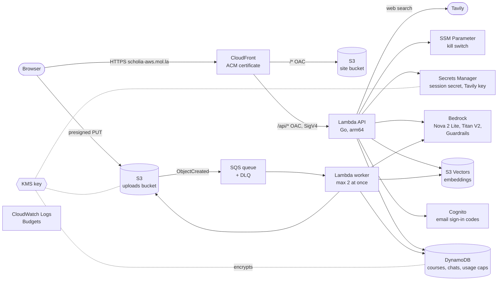

# Scholia

[](https://github.com/SumonMSelim/scholia-aws/actions/workflows/ci.yml)
[](https://go.dev/)
[](LICENSE)

Scholia turns a course's lecture transcripts, slides, notes and assignments into a knowledge base that answers questions with citations to the exact lecture moment, slide or page, and helps you prepare for exams. The name comes from *scholia*, the notes scholars wrote in the margins of classical texts.

**Live app:** https://scholia-aws.mol.la (click **Try the demo, no sign-up**; guest data is deleted after 48 hours)

Every visitor starts with a ready demo course, MIT 6.006 *Introduction to Algorithms*, so the first question gets a cited answer in seconds. When an answer cites a lecture moment, **Watch** plays the lecture recording from that second, right under the answer.

## What it does

You create a course, add lecture PDFs, slides, captions (VTT, SRT), markdown notes and LaTeX (Overleaf) files, then chat with it. Each chat is tied to one course and one model. The assistant:

- answers questions from the course material, citing the page, slide or lecture moment, and uses the web (Tavily) when the material is thin;
- works through assignments step by step and reviews your answers against the course;
- runs mock exams, one question at a time, and grades each answer;
- refuses questions that aren't about the course, and handles abusive or harmful messages with a fixed, calm reply.

## Demo course

The public demo course is seeded from openly licensed material and is read-only for everyone:

- 19 lecture transcripts and 18 sets of lecture notes from [MIT OpenCourseWare 6.006 Introduction to Algorithms, Spring 2020](https://ocw.mit.edu/courses/6-006-introduction-to-algorithms-spring-2020/), by Erik Demaine, Jason Ku and Justin Solomon. License: [CC BY-NC-SA 4.0](https://creativecommons.org/licenses/by-nc-sa/4.0/).
- [Open Data Structures](https://opendatastructures.org/) (pseudocode edition) by Pat Morin. License: [CC BY 2.5 Canada](https://creativecommons.org/licenses/by/2.5/ca/).

The text is split into passages for search and not otherwise changed. Lecture videos play from MIT OpenCourseWare's YouTube channel in the privacy-enhanced player. Scholia is not affiliated with or endorsed by MIT or the authors.

`cmd/seed` downloads the files into `data/demo/` and queues them through the normal upload pipeline. Running it again queues only files that are missing or failed.

```sh
cd infra/terraform/envs/prod
TABLE_NAME=$(terraform output -raw table_name) UPLOADS_BUCKET=$(terraform output -raw uploads_bucket) make -C ../../../.. seed-demo
```

## Running on AWS

### Architecture



The bootstrap stack adds the Terraform state bucket, a monthly budget with email alerts, and account-wide S3 Block Public Access.

### Services and what they do

| Service | Purpose |
|---|---|
| Amazon CloudFront | Serves the SPA and fronts the API on one domain; origin access control signs every request to S3 and the Lambda function URL, so neither is reachable directly |
| AWS Certificate Manager | TLS certificate for `scholia-aws.mol.la` |
| Amazon S3 | Site bucket for the web build; uploads bucket for course files and chat attachments (presigned, size-signed PUTs; guest files expire after 3 days) |
| AWS Lambda | Go API behind a function URL, and the ingest worker that parses PDFs, slides, notes and transcripts |
| Amazon SQS | Queue between upload events and the worker, with a dead-letter queue for failed files |
| Amazon Bedrock | Nova 2 Lite for chat, Titan Text Embeddings V2 for retrieval, Guardrails for harmful content and prompt attacks |
| Amazon S3 Vectors | Stores and queries chunk embeddings per course |
| Amazon DynamoDB | Courses, sources, chats, messages and the daily usage caps |
| Amazon Cognito | Passwordless email sign-in codes |
| AWS Secrets Manager | Session signing secret and the Tavily API key |
| AWS Systems Manager Parameter Store | Kill switch that stops model calls without a redeploy |
| AWS KMS | Customer managed key for the table, uploads, secrets, logs and users' stored provider keys |
| Amazon CloudWatch | Logs for the API and worker |
| AWS Budgets | Monthly cost budget with email alerts |
| AWS IAM | Least-privilege roles per function |

Everything is defined in Terraform under [`infra/terraform`](infra/terraform).

## License

[MIT](LICENSE)
